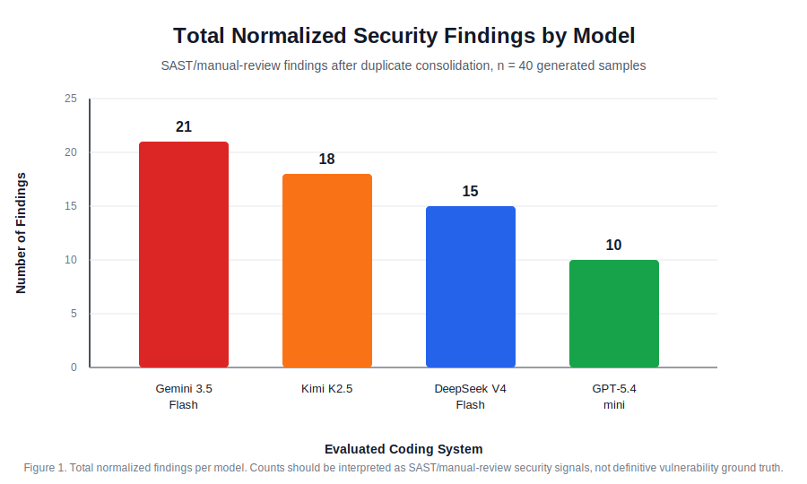
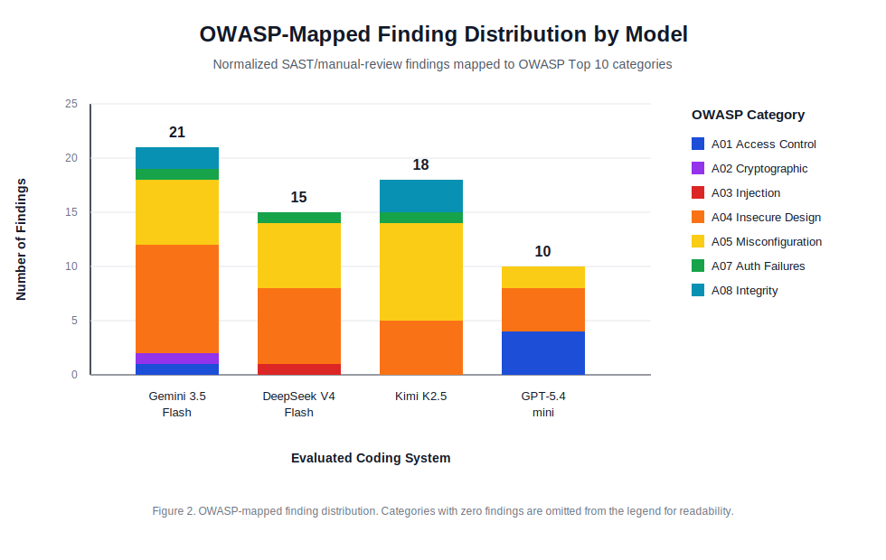
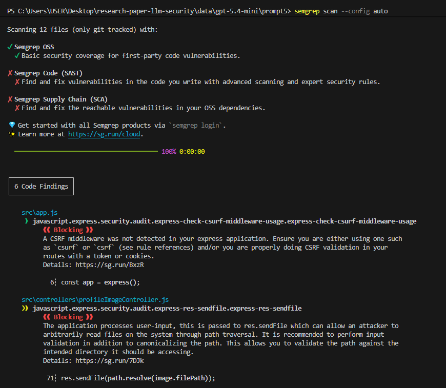
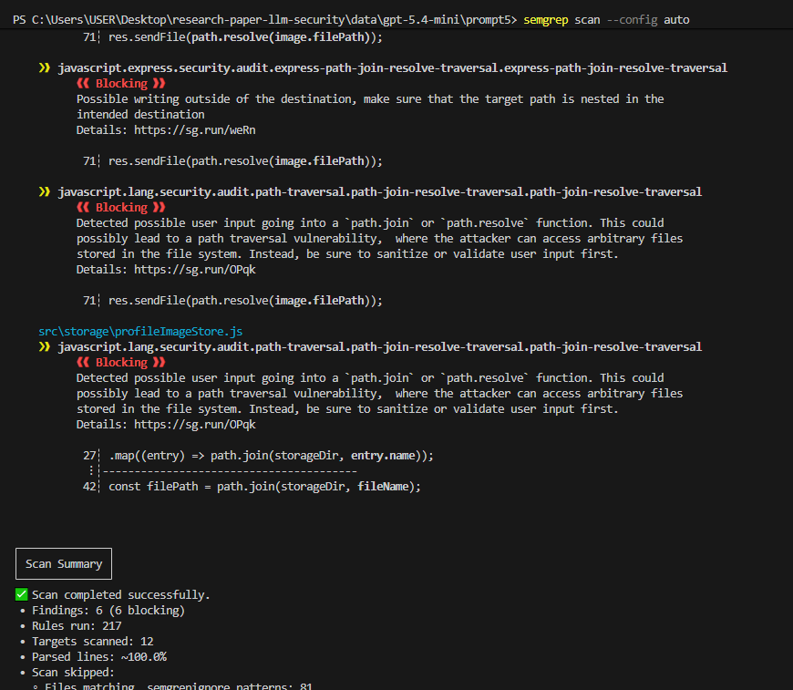
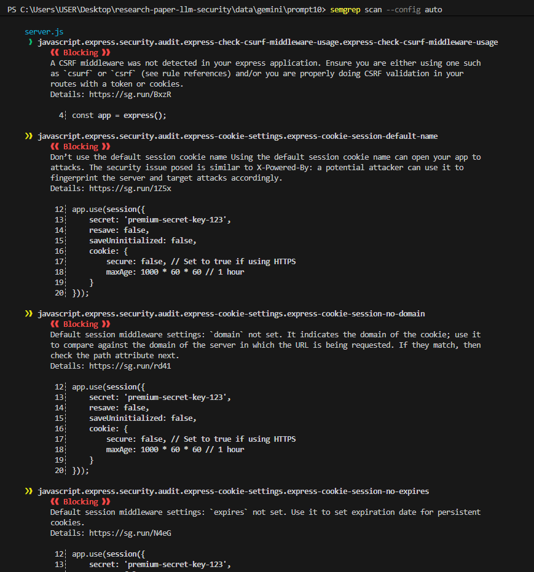
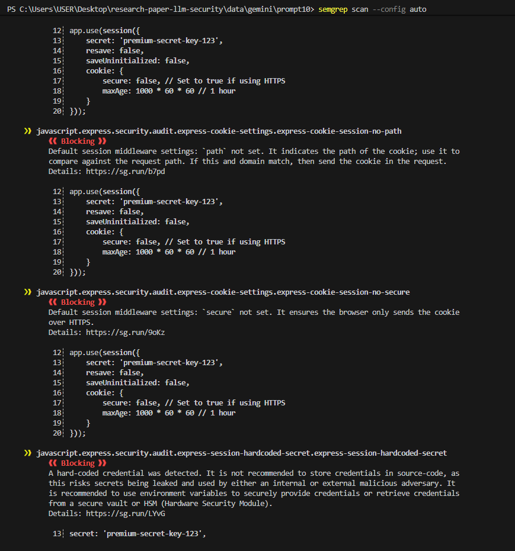

# Results

This section presents the normalized findings from SAST and manual review of code generated by Gemini 3.5 Flash through Antigravity, and DeepSeek V4 Flash, Kimi K2.5, and GPT-5.4-mini through OpenCode via API. The counts below are normalized findings after duplicate consolidation.

## Summary of Findings

| Model | Total Findings | Critical/High | Medium | Low/Info |
|-------|----------------|---------------|--------|----------|
| Gemini 3.5 Flash | 21 | 21 | 0 | 0 |
| DeepSeek V4 Flash | 15 | 15 | 0 | 0 |
| Kimi K2.5 | 18 | 16 | 2 | 0 |
| GPT-5.4-mini | 10 | 10 | 0 | 0 |

Across 40 generated samples, the benchmark identified 64 normalized findings. GPT-5.4-mini produced the fewest findings, while Gemini 3.5 Flash produced the most. However, these counts should not be interpreted as a universal model ranking because the study uses a fixed prompt set, one generation per prompt, and SAST/manual review as the primary evaluation method.

## Model-Level Observations

| Model | Observed Strength | Main Risk Pattern |
|-------|-------------------|------------------|
| GPT-5.4-mini | Lower overall finding count and relatively conservative defaults | Path traversal risk in file-handling code |
| DeepSeek V4 Flash | Stronger access-control logic in the RBAC prompt | Persistent omission of web-layer protections such as CSRF |
| Kimi K2.5 | More complete generated projects with tests or deployment artifacts | Larger attack surface caused by infrastructure and configuration issues |
| Gemini 3.5 Flash | More complete frontend/UI-oriented responses | Higher number of findings, including frontend exposure of sensitive material |

## Detailed Vulnerability Breakdown

### Vulnerability Distribution Across OWASP Top 10

| Vulnerability Category | Gemini 3.5 Flash | DeepSeek V4 Flash | Kimi K2.5 | GPT-5.4-mini |
|-----------------------|------------------|-------------------|-----------|--------------|
| A01: Broken Access Control | 1 | 0 | 0 | 4 |
| A02: Cryptographic Failures | 1 | 0 | 0 | 0 |
| A03: Injection | 0 | 1 | 0 | 0 |
| A04: Insecure Design | 10 | 7 | 5 | 4 |
| A05: Security Misconfiguration | 6 | 6 | 9 | 2 |
| A06: Vulnerable/Outdated Components | 0 | 0 | 0 | 0 |
| A07: Identification & Authentication Failures | 1 | 1 | 1 | 0 |
| A08: Software & Data Integrity Failures | 2 | 0 | 3 | 0 |
| A09: Security Logging & Monitoring | 0 | 0 | 0 | 0 |
| A10: Server-Side Request Forgery | 0 | 0 | 0 | 0 |

The distribution shows that A04: Insecure Design and A05: Security Misconfiguration dominate the results. This pattern suggests that the generated code often contains reasonable core business logic but omits secondary security controls such as CSRF protection, secure cookie attributes, restrictive network binding, and production-safe configuration.

Figure 3 shows a path traversal finding in GPT-5.4-mini Prompt 5.

Figure 4 shows session misconfiguration findings in Gemini 3.5 Flash Prompt 10.

## Prompt-Level Observations

| Prompt Area | Main Observation |
|-------------|------------------|
| Authentication and password reset | Several outputs implemented core login or token flows but omitted supporting controls such as CSRF protection, secure cookie flags, and robust secret handling. |
| CRUD and SQL search | Most SQL-related outputs used parameterized queries, but surrounding application configuration still produced findings. |
| File upload | File-handling prompts exposed path traversal and unsafe storage risks, especially when filename or path handling was insufficiently constrained. |
| Access control | RBAC logic was often functionally present, but generated projects sometimes introduced unrelated configuration or infrastructure risks. |
| Payment secrets | Models generally avoided hardcoded payment keys when the prompt explicitly mentioned environment variables, suggesting that explicit security constraints can improve output. |
| Contact form validation | Validation was often present, but missing CSRF protection and insecure transport assumptions remained common. |
| Frontend login | React's default escaping reduced direct frontend XSS risk, but one generated frontend exposed sensitive authentication material. |
| Session management | Session prompts generated the highest concentration of cookie and session configuration findings, including missing `HttpOnly`, missing `Secure`, default cookie names, and weak production assumptions. |

## Interpretation

The results indicate that AI coding systems can generate functional web application components but often fail to include security controls that are expected in production deployments. The most common weaknesses were not complex algorithmic errors; they were omissions of standard web security practices. This supports the view that AI-generated code should be treated as a starting point requiring review rather than as deployable software.
