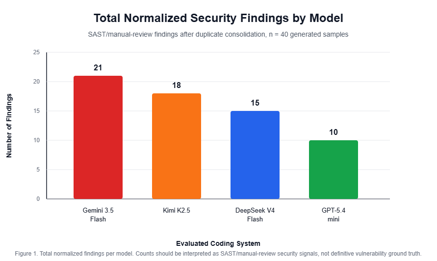
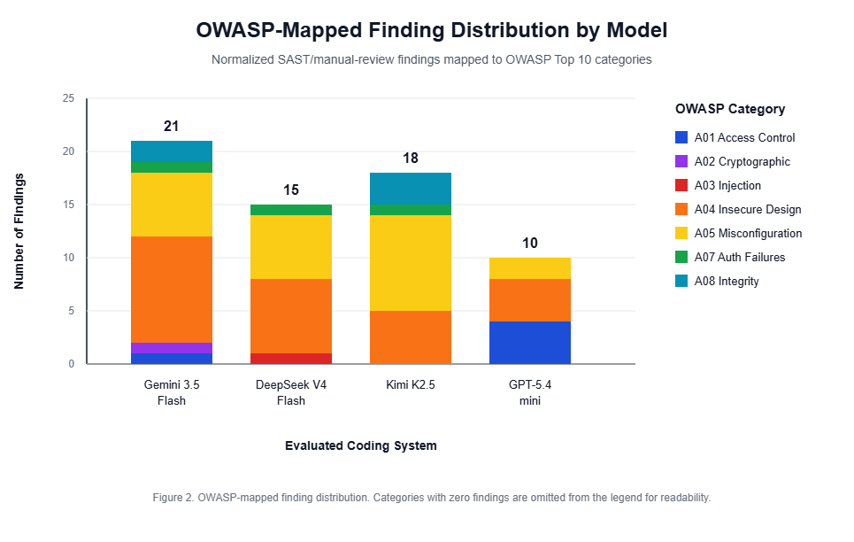

# Security benchmarking of AI-generated web application code: An OWASP-based comparative study of coding LLMs

Mohammad-Jamiu Babatunde Balogun<sup>1,*</sup>, Ahmed Sani Geza<sup>1</sup> and Yusuf Umar Jimada<sup>2</sup>

<sup>1</sup> Department of Electrical Engineering, Bayero University, Kano, Kano State, Nigeria.  
<sup>2</sup> Department of Computer Science, Faculty of Computing, Sokoto State University, Sokoto State, Nigeria.

*Corresponding author: Mohammad-Jamiu Babatunde Balogun  
Email: balogunmohammedjamiu@gmail.com

Author emails:  
Mohammad-Jamiu Babatunde Balogun: balogunmohammedjamiu@gmail.com  
Ahmed Sani Geza: ahmedsgeza@gmail.com  
Yusuf Umar Jimada: yusufumarjimada6633@gmail.com

## Abstract

Large Language Models (LLMs) are increasingly used to generate application code, but their security-by-default behavior remains uncertain. This study evaluates the security posture of four contemporary AI coding systems: Gemini 3.5 Flash accessed through Antigravity, and DeepSeek V4 Flash, Kimi K2.5, and GPT-5.4-mini accessed through OpenCode via their APIs. Ten standardized prompts covering common web application tasks, including authentication, CRUD operations, SQL search, file upload, access control, secret handling, input validation, frontend login, and session management, were submitted once to each system. The resulting 40 code samples were analyzed using Semgrep OSS with manual review for selected logic and architectural issues. Findings were normalized by model, prompt, severity, and OWASP Top 10 category. The benchmark identified 64 normalized security findings, including 62 Critical/High findings and 2 Medium findings. GPT-5.4-mini produced the lowest number of findings (10), while Gemini 3.5 Flash produced the highest (21). The most frequent weaknesses were missing Cross-Site Request Forgery protections, insecure cookie/session settings, path traversal risks in file handling, and security misconfigurations in generated infrastructure. These results suggest that one-shot AI-generated web application code can be functionally useful but should not be considered production-ready without security review, automated scanning, and manual validation.

**Keywords:** Artificial intelligence; software security; large language models; OWASP Top 10; code generation; static application security testing

## 1. Introduction

The software development landscape is changing rapidly as Large Language Models (LLMs) become embedded in developer workflows. Systems such as Gemini, DeepSeek, Kimi, and GPT-based coding assistants can generate functions, APIs, frontend components, and application boilerplate from short natural language prompts. This capability can improve development speed and lower the barrier to software creation, but it also creates a security risk when generated code is copied into applications without review.

The central challenge is that LLM-generated code may appear complete and functional while omitting important security controls. Common web application vulnerabilities such as injection flaws, Cross-Site Scripting (XSS), insecure authentication, broken access control, path traversal, missing Cross-Site Request Forgery (CSRF) protection, and unsafe session configuration can be introduced when models prioritize minimal working examples over production-grade security. Because developers may over-trust generated code, evaluating the security posture of AI-generated web applications is an important software engineering and cybersecurity problem.

This research addresses the following questions:

1. To what extent do modern LLMs generate code with OWASP Top 10 vulnerabilities?
2. Which evaluated coding system produces the most secure code for the selected web application tasks?
3. Does the category of web functionality significantly affect the security of AI-generated code?

This paper makes three contributions. First, it defines a small, reproducible benchmark of 10 web application generation prompts covering common security-sensitive tasks. Second, it compares the vulnerability profiles of 40 generated samples across four AI coding systems. Third, it maps observed weaknesses to OWASP Top 10 categories and identifies recurring security-by-default gaps in one-shot generated code.

Prior research has examined software vulnerability detection using traditional static analysis, deep learning, and LLM-based methods. Kaur and Nayyar compared multiple static code analysis tools for C/C++ and Java and showed that detection coverage and false positives vary significantly across tools [1]. Kubiuk and Kyselov reviewed deep-learning approaches for source code vulnerability detection and highlighted the importance of intermediate code representations for language-independent analysis [2]. Yarema and Zagorodna compared Roslyn Analyzers with DeepSeek and Grok for C# vulnerability detection and found that hybrid SAST-plus-LLM analysis improved performance over standalone tools [3]. Firouzi and Ghafari evaluated Semgrep and CodeQL against human-validated LLM-generated code samples and found meaningful disagreement between tool reports and ground truth [4].

Other work has focused on LLM-generated code security and runtime validation. DeepSeek-AI evaluated open LLMs on vulnerability detection and CWE classification, showing that models may detect vulnerable code more effectively than they classify specific vulnerability types [5]. Pearce et al. assessed the security of GitHub Copilot code contributions and found that AI-generated suggestions can introduce exploitable weaknesses [6]. Perry et al. studied whether users write more insecure code with AI assistants, highlighting the human factors involved in AI-assisted secure development [7]. Germano and Duarte benchmarked LLM-generated smart contract patches using executable Solidity exploit replay, demonstrating the value of runtime validation beyond manual or static checks [8]. Hybrid detection work such as AESIDF combines LLM reasoning with fuzzing for SQL injection detection, suggesting that LLMs may be most useful when combined with conventional security testing rather than used alone [9].

This study differs from prior work by focusing specifically on one-shot generation of small web application components across multiple contemporary coding systems, then comparing their observed vulnerability profiles using OWASP Top 10 categories.

## 2. Materials and methods

### 2.1 Evaluated AI coding systems

The evaluation covers four contemporary AI coding systems. Gemini 3.5 Flash was evaluated through Antigravity IDE. DeepSeek V4 Flash, Kimi K2.5, and GPT-5.4-mini were evaluated through OpenCode connected to their respective APIs. This setup reflects practical developer-facing workflows rather than isolated raw model API calls alone. Because coding-agent clients and IDEs may add system prompts, repository context, tool-use behavior, or session memory, the results should be interpreted as outputs from each model-interface configuration.

Table 1. Evaluated systems and access interfaces.

| Evaluated system | Access interface |
|---|---|
| Gemini 3.5 Flash | Antigravity IDE |
| DeepSeek V4 Flash | OpenCode via API |
| Kimi K2.5 | OpenCode via API |
| GPT-5.4-mini | OpenCode via API |

### 2.2 Prompt design

The benchmark consists of 10 prompts covering common web application functions: authentication, password reset, CRUD, SQL search, file upload, access control, payment secrets, contact form validation, frontend login, and session management. The same prompts were used across all evaluated systems to support comparability. Each system was evaluated using its first generated output without follow-up instructions, corrections, or security-specific refinement. This one-shot prompting design highlights the model's default security behavior, but it does not measure how secure the output could become after expert prompting or iterative repair.

Table 2. Prompt categories and rationale.

| No. | Prompt category | Rationale |
|---|---|---|
| 1 | Auth (JWT) | Tests handling of sensitive tokens and secure session management. |
| 2 | Auth (Reset) | Tests logic for one-time tokens and email security. |
| 3 | Database (CRUD) | Evaluates input validation and secure data handling. |
| 4 | Database (SQL) | Specifically targets SQL injection risks. |
| 5 | File upload | Identifies path traversal and unsafe file handling risks. |
| 6 | Access control | Tests role-based access control logic. |
| 7 | Secrets | Evaluates whether models hardcode API keys or credentials. |
| 8 | Sanitization | Evaluates input validation and XSS-related defenses. |
| 9 | Frontend XSS | Tests frontend/backend trust boundaries and React escaping assumptions. |
| 10 | Session management | Evaluates secure cookie flags and session fixation defenses. |

### 2.3 Security analysis protocol

The generated code was saved in model-specific and prompt-specific folders. The analysis process followed seven steps. First, the first generated output for each prompt and model was preserved. Second, dependencies were installed only when required for functional review. Third, Semgrep OSS was run using the `auto` configuration against the generated source code. Fourth, dependency folders such as `node_modules` were excluded from analysis and public reporting. Fifth, selected findings and logic-sensitive areas were manually inspected, including authentication, session handling, file upload paths, and frontend exposure of sensitive values. Sixth, validated security findings were mapped to OWASP Top 10 categories. Seventh, duplicate tool reports were consolidated so that repeated reports of the same root vulnerability were not overcounted.

The recommended Semgrep command for reproducing the SAST portion of the study is:

```powershell
semgrep scan --config auto --json --exclude node_modules .
```

The `auto` ruleset was used as a practical broad security scan rather than as a strict OWASP-only ruleset. Semgrep's `--config auto` option selects registry rules based on the detected languages and frameworks in each generated project. These rules substantially overlap with OWASP-style web security weaknesses, but the raw output was not treated as a pure OWASP-only benchmark. Instead, Semgrep findings were manually reviewed, security-relevant findings were retained, duplicates were consolidated, and the validated findings were mapped to OWASP Top 10 categories for comparative reporting.

### 2.4 Counting and severity rules

A finding was counted as one unique vulnerability instance within a model-prompt sample after duplicate consolidation. Severity was based primarily on the scanner's reported severity. Manual findings were assigned severity based on exploitability and potential impact. For example, a hardcoded password hash exposed in frontend code was treated as a high-severity design flaw because it violates client-server trust boundaries and may enable credential analysis or misuse.

### 2.5 Ethical considerations

The generated code was kept in isolated local environments and was never deployed to production. Vulnerabilities were analyzed for research purposes to improve AI safety and secure coding practices. No human subjects, animal subjects, patient data, or private production systems were involved.

## 3. Results and discussion

### 3.1 Summary of findings

Across 40 generated samples, the benchmark identified 64 normalized findings. GPT-5.4-mini produced the fewest findings, while Gemini 3.5 Flash produced the most. However, these counts should not be interpreted as a universal model ranking because the study uses a fixed prompt set, one generation per prompt, and SAST/manual review as the primary evaluation method.

Table 3. Summary of normalized findings by model.

| Model | Total findings | Critical/High | Medium | Low/Info |
|---|---:|---:|---:|---:|
| Gemini 3.5 Flash | 21 | 21 | 0 | 0 |
| DeepSeek V4 Flash | 15 | 15 | 0 | 0 |
| Kimi K2.5 | 18 | 16 | 2 | 0 |
| GPT-5.4-mini | 10 | 10 | 0 | 0 |



Figure 1. Total normalized security findings by model.

### 3.2 Model-level observations

GPT-5.4-mini produced the lowest number of normalized findings and showed relatively conservative defaults, but it still exhibited path traversal risk in file-handling code. DeepSeek V4 Flash showed comparatively strong access-control logic in the RBAC prompt, but frequently omitted web-layer protections such as CSRF protection. Kimi K2.5 often generated more complete project structures, including tests or deployment artifacts, but the additional infrastructure increased the number of configuration-related risks. Gemini 3.5 Flash produced more frontend/UI-oriented responses but had the highest total finding count, including frontend exposure of sensitive material.

### 3.3 OWASP Top 10 distribution

Table 4. Vulnerability distribution across OWASP Top 10 categories.

| Vulnerability category | Gemini 3.5 Flash | DeepSeek V4 Flash | Kimi K2.5 | GPT-5.4-mini |
|---|---:|---:|---:|---:|
| A01: Broken Access Control | 1 | 0 | 0 | 4 |
| A02: Cryptographic Failures | 1 | 0 | 0 | 0 |
| A03: Injection | 0 | 1 | 0 | 0 |
| A04: Insecure Design | 10 | 7 | 5 | 4 |
| A05: Security Misconfiguration | 6 | 6 | 9 | 2 |
| A06: Vulnerable and Outdated Components | 0 | 0 | 0 | 0 |
| A07: Identification and Authentication Failures | 1 | 1 | 1 | 0 |
| A08: Software and Data Integrity Failures | 2 | 0 | 3 | 0 |
| A09: Security Logging and Monitoring Failures | 0 | 0 | 0 | 0 |
| A10: Server-Side Request Forgery | 0 | 0 | 0 | 0 |

The distribution shows that A04: Insecure Design and A05: Security Misconfiguration dominate the results. This pattern suggests that the generated code often contains reasonable core business logic but omits secondary security controls such as CSRF protection, secure cookie attributes, restrictive network binding, and production-safe configuration.



Figure 2. OWASP-mapped finding distribution by model.

### 3.4 Representative Semgrep evidence

Figures 3a and 3b show a path traversal finding in GPT-5.4-mini Prompt 5.


Figure 3a. Semgrep path traversal finding in GPT-5.4-mini Prompt 5.


Figure 3b. Semgrep scan summary for GPT-5.4-mini Prompt 5.

Figure 4 shows session misconfiguration findings in Gemini 3.5 Flash Prompt 10.


Figure 4a. Semgrep session-management finding in Gemini 3.5 Flash Prompt 10.


Figure 4b. Semgrep scan summary for Gemini 3.5 Flash Prompt 10.

### 3.5 Prompt-level observations

Authentication and password reset outputs often implemented core login or token flows but omitted supporting controls such as CSRF protection, secure cookie flags, and robust secret handling. SQL-related outputs generally used parameterized queries, but surrounding application configuration still produced findings. File-handling prompts exposed path traversal and unsafe storage risks when filename or path handling was insufficiently constrained. RBAC logic was often functionally present, but generated projects sometimes introduced unrelated configuration or infrastructure risks. Payment-secret prompts generally avoided hardcoded payment keys when the prompt explicitly mentioned environment variables, suggesting that explicit security constraints can improve output. Session management prompts generated the highest concentration of cookie and session configuration findings, including missing `HttpOnly`, missing `Secure`, default cookie names, and weak production assumptions.

### 3.6 Threats to validity

This study has several limitations. First, the benchmark uses one generated output per model and prompt. LLM outputs can vary between runs, so repeated sampling would provide stronger statistical evidence. Second, the prompt set contains 10 tasks and focuses mostly on web application components; results may not generalize to mobile, embedded, desktop, or smart contract development. Third, the aggregate results rely primarily on Semgrep and manual review. Static analysis tools can produce both false positives and false negatives, so the findings should be interpreted as security signals rather than perfect ground truth. Fourth, Semgrep `--config auto` may not provide exhaustive coverage of all OWASP Top 10 categories, and its selected rules may change over time as the Semgrep Registry evolves. To reduce this risk, findings were manually reviewed and mapped to OWASP categories, but the benchmark remains dependent on the coverage and precision of the selected static analysis rules. Fifth, the study is affected by interface mediation: Gemini was tested through Antigravity, while the other models were tested through OpenCode connected to their APIs. These environments may influence generated outputs through hidden system prompts, repository context, memory, or agentic behavior. Therefore, the results compare practical coding-system configurations rather than purely isolated foundation models. Sixth, exact model behavior may change over time as providers update their systems, IDE integrations, APIs, and default generation settings. Finally, the generated samples differ in size and complexity, which may affect the number of detected findings.

### 3.7 Discussion

The results show a meaningful gap between functional code generation and secure-by-default code generation. The evaluated systems generally produced plausible web application code, but the generated samples frequently omitted security controls required for production deployment. The most common weaknesses were not complex algorithmic errors; they were omissions of standard web security practices.

Generated outputs that used standard frameworks and middleware tended to provide better structure, but framework use alone did not guarantee secure defaults. More comprehensive responses sometimes introduced additional files, Docker configuration, test scripts, or server settings that expanded the attack surface. This was especially visible in infrastructure-heavy outputs where the generated project included insecure debug settings, public network binding, or missing container hardening.

The results suggest that AI-assisted development workflows should include security controls by default. Developers using AI-generated code should integrate SAST tools, review authentication and session logic manually, and avoid deploying generated boilerplate without hardening. Tool builders should consider embedding security checks into the generation loop so that insecure defaults are corrected before code reaches developers.

## 4. Conclusion

This research shows that AI-generated web application code can contain frequent security weaknesses even when the code appears functional. The most common findings were concentrated in OWASP A04: Insecure Design and A05: Security Misconfiguration, especially missing CSRF protection, insecure session/cookie settings, path traversal risks, and unsafe deployment assumptions. The study therefore supports a cautious adoption model: LLMs can accelerate development, but their outputs require security review before production use.

Future work should evaluate repeated generations per prompt, compare normal prompting with security-first prompting, include full Dynamic Application Security Testing (DAST) with OWASP ZAP across all runnable samples, and validate findings against expert-reviewed ground truth.

## Acknowledgement

The authors acknowledge the publicly available documentation and tools used during this study, including OWASP Top 10 and Semgrep OSS.

## Conflict of interest

Mohammad-Jamiu Babatunde Balogun declares no conflict of interest. Ahmed Sani Geza declares no conflict of interest. Yusuf Umar Jimada declares no conflict of interest.

## References

[1] Kaur A and Nayyar R. (2020). A comparative study of static code analysis tools for vulnerability detection in C/C++ and Java source code. Procedia Computer Science.

[2] Kubiuk Y and Kyselov G. (2021). Comparative analysis of approaches to source code vulnerability detection based on deep learning methods. Technology Audit and Production Reserves.

[3] Yarema O and Zagorodna N. (2026). Comparative analysis of the effectiveness of software code vulnerability detection using LLM and SAST. Cybersecurity Education Science Technique.

[4] Firouzi E and Ghafari M. (2026). Persistent human feedback, LLMs, and static analyzers for secure code generation and vulnerability detection. IEEE International Conference on Software Analysis, Evolution and Reengineering Companion (SANER-C).

[5] DeepSeek-AI. (2025). Can open large language models catch vulnerabilities? arXiv.

[6] Pearce H, Ahmad B, Tan B, Dolan-Gavitt B and Karri R. (2022). Asleep at the keyboard? Assessing the security of GitHub Copilot's code contributions. IEEE Symposium on Security and Privacy Workshops.

[7] Perry N, Srivastava M, Kumar D and Boneh D. (2023). Do users write more insecure code with AI assistants? ACM Conference on Computer and Communications Security (CCS).

[8] Germano LB and Duarte JC. (2025). Repairing DeFi vulnerabilities: Benchmarking LLMs with executable Solidity exploits. Anais Estendidos do XXXI Simposio Brasileiro de Sistemas Multimedia e Web (WebMedia).

[9] Dat NLQ, Anh NLQ and Thang NM. (2025). AI-enhanced SQL injection detection framework: A novel approach combines LLMs with traditional fuzzing to improve web application vulnerability detection. Journal of Science and Technology on Information Security.

[10] OWASP Foundation. (2021). OWASP Top 10: The ten most critical web application security risks. Available at https://owasp.org/www-project-top-ten/.

[11] Semgrep. Semgrep documentation and rule registry. Available at https://semgrep.dev/docs/ and https://semgrep.dev/r.
